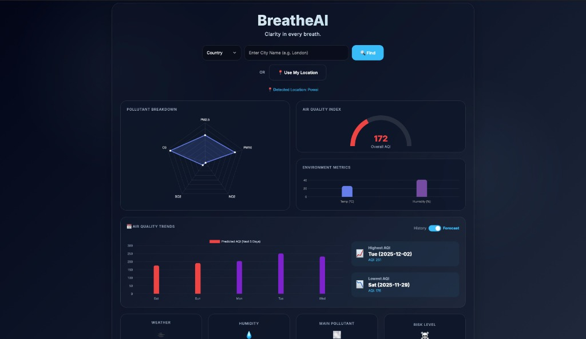
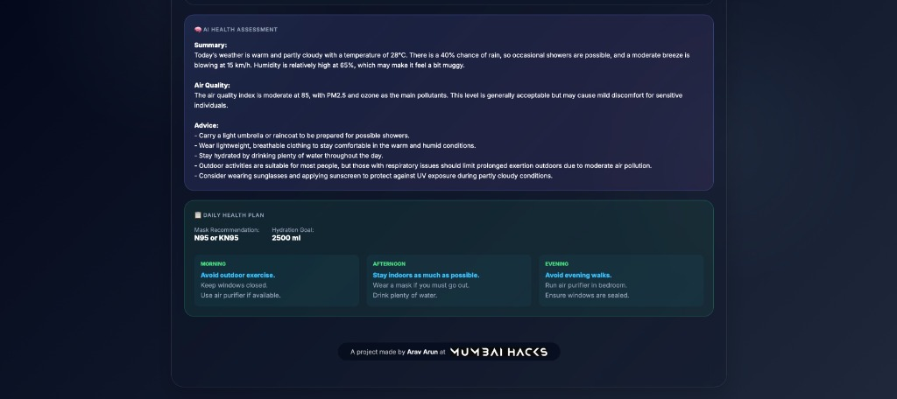
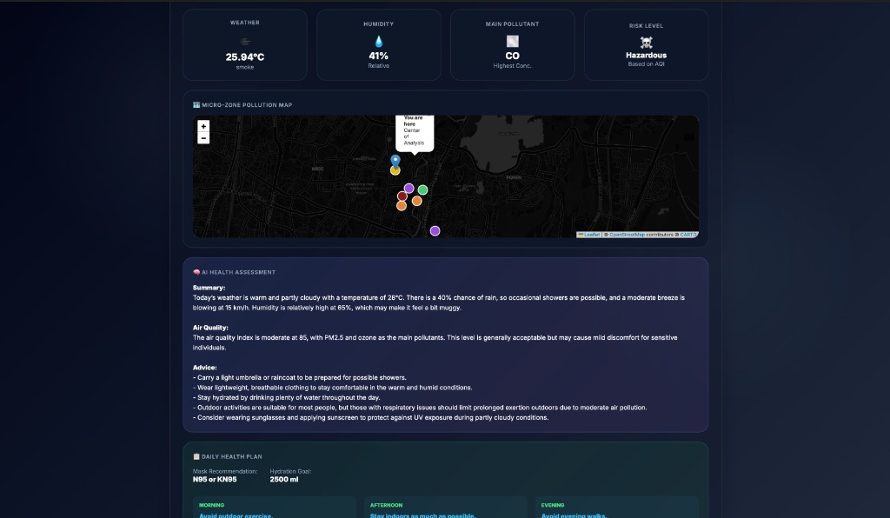

# 🌬️ BreatheAI - Clarity in every breath

A comprehensive agentic AI system designed to help individuals navigate India's severe air pollution problem through intelligent, autonomous agents that collect data, reason about health impacts, and plan personalized actions.


## 📸 Screenshots

| Dashboard | Health Assessment |
|:---:|:---:|
|  |  |

| Pollution Map | Search |
|:---:|:---:|
|  |  |


## 🎯 Features

### Core Agentic Architecture
1.  **Environment Agent**: Collects real-time environmental data (AQI, PM2.5, Weather) and simulates micro-zone pollution hotspots.
2.  **Health Reasoning Agent**: Uses **Relevance AI** (LLM) to analyze health risks with deep scientific context.
3.  **Planner Agent**: Generates actionable, rich-text daily health plans tailored to specific AQI levels.

### 🎨 UI Features
-   **Glassmorphism Design**: Modern, premium "Night Mode" UI with deep blue gradients.
-   **Micro-Zone Map**: Interactive Leaflet.js map visualizing pollution hotspots (Traffic, Construction, etc.).
-   **Deep Health Planner**: Detailed, 5-6 point health plans for Morning, Afternoon, and Evening.
-   **Forecast & History**: 5-Day AQI Prediction and 7-Day Historical Analysis using OpenWeatherMap.
-   **Real-time Updates**: Live data fetching and dynamic chart rendering.
-   **Mobile Responsive**: Fully optimized for all screen sizes.

## 🚀 Quick Start

### Prerequisites
-   Python 3.8+
-   `pip`

### Installation

1.  Clone the repository:
    ```bash
    git clone https://github.com/Arav-Arun/breatheAI_MumbaiHacks.git
    cd breatheAI_MumbaiHacks
    ```

2.  Install dependencies:
    ```bash
    pip install -r requirements.txt
    ```

3.  Set up environment variables:
    Create a `.env` file in the root directory:
    ```env
    OPENWEATHER_API_KEY=your_key_here
    RELEVANCE_PROJECT=your_project_id
    RELEVANCE_API_KEY=your_api_key
    RELEVANCE_REGION=your_region
    ```

4.  Run the application:
    ```bash
    ./run.sh
    ```
    Or manually:
    ```bash
    python backend/app.py
    ```

5.  Open your browser at `http://localhost:5001`

## 📁 Project Structure

```
MumbaiHacks/
├── backend/
│   ├── app.py                  # Main Flask Application
│   └── ai/                     # Autonomous Agents
│       ├── environment_agent.py # Data Collection & AQI Calculation
│       ├── reasoning_agent.py   # LLM Health Analysis
│       └── planner_agent.py     # Daily Plan Generation
├── frontend/
│   ├── templates/
│   │   └── index.html          # Main Dashboard
│   └── static/
│       ├── css/                # Styles (Glassmorphism)
│       ├── js/                 # Frontend Logic (Charts, Maps)
│       └── assets/             # Images & Logos
├── requirements.txt            # Python Dependencies
├── vercel.json                 # Deployment Config
└── README.md                   # Documentation
```

## 📊 Tech Stack

-   **Backend**: Python, Flask
-   **AI/LLM**: Relevance AI (Agentic Reasoning)
-   **Data**: OpenWeatherMap API (Weather, Air Pollution, Geocoding)
-   **Frontend**: HTML5, CSS3 (Glassmorphism), JavaScript (ES6+)
-   **Visualization**: Chart.js (Graphs), Leaflet.js (Maps)
-   **Deployment**: Vercel Ready

## 👥 Team Tetrabytes
- Arav Arun
- Harshad Saha
- Asmit Samanta
- Faizaan Farooqui

Built with ❤️ by **Team Tetrabytes** for **Mumbai Hacks 2025**.