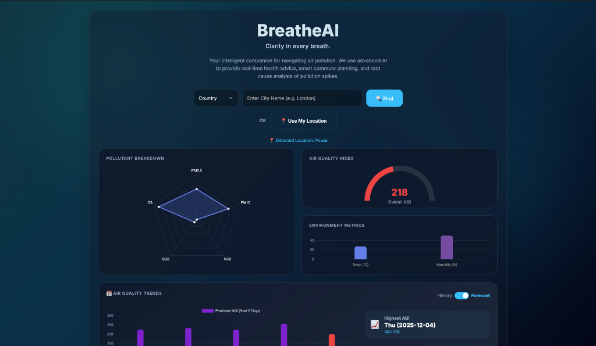
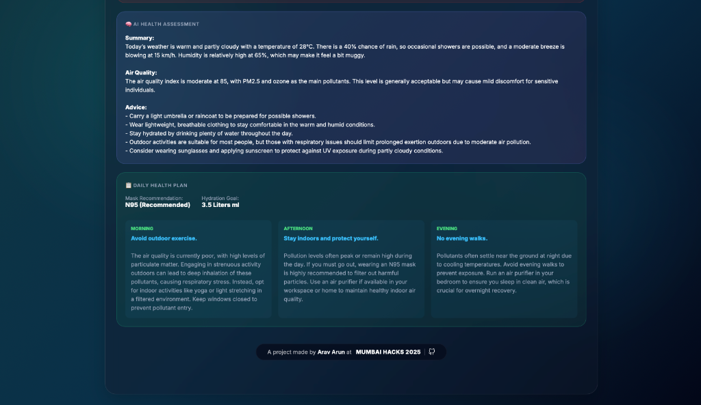
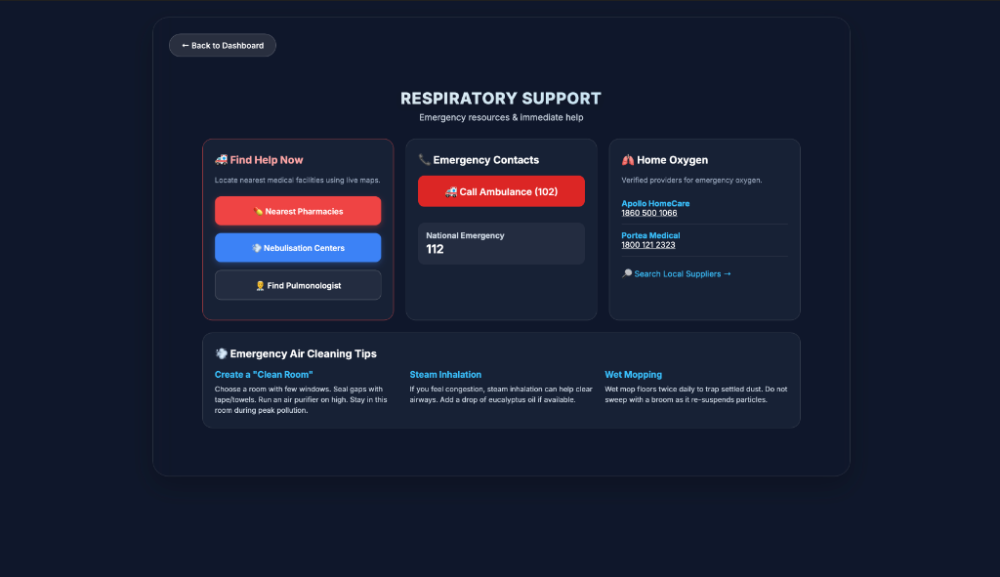

# BreatheAI - Clarity in every breath

A comprehensive agentic AI system designed to help individuals navigate India's severe air pollution problem through intelligent, autonomous agents that collect data, reason about health impacts, and plan personalized actions.

## 📸 Screenshots

| Landing & Dashboard | Real-time Analysis |
|:---:|:---:|
|  |  |

| Advanced Charts | Micro-Zone Map |
|:---:|:---:|
|  |  |

| Local News | News Filtering |
|:---:|:---:|
|  |  |

| Respiratory Support Directory |
|:---:|
|  |
# BreatheAI 🌬️

### **Intelligent Air Quality Monitoring & Health Advisory System**

BreatheAI is a smart environmental dashboard that provides real-time air quality metrics, advanced weather data, and **AI-powered health advice**. It goes beyond simple data display by using **Relevance AI** to generate personalized health plans based on current pollution levels.

---

## **🚀 Features**

- **Real-time Air Quality**: Detailed breakdown of pollutants (PM2.5, PM10, NO2, etc.).
- **AI Health Advisory**: Context-aware health plans generated by an LLM Agent (Relevance AI).
- **Smart Planning**: Morning, Afternoon, and Evening activity guides based on air quality.
- **Pollution Forecasting**: 5-day predictive modeling for air quality trends.
- **Emergency Support**: Location-based emergency contact numbers.
- **Local News**: Latest pollution-related news for your specific city.
- **Mobile Optimized**: Fully responsive design for on-the-go usage.

---

## **📂 Project Structure**

```
breatheAI/
├── app.py              # Main Flask Application
├── ai_models/          # Python Logic & AI Services
│   ├── advisory.py     # Health Reasoning Agent
│   ├── environment.py  # Data Aggregation Service
│   ├── planner.py      # Daily Activity Planner
│   └── news.py         # Google News Scraper
├── pages/              # HTML Templates
│   ├── index.html      # Main Dashboard
│   ├── news.html       # News Page
│   └── support.html    # Emergency Support Page
├── ui/                 # Frontend Assets (JS/CSS)
│   ├── script.js       # Client-side Logic
│   └── style.css       # Styling & Animations
├── assets/             # Images & Static Media
└── data/               # Configuration Data
```

---

## **🛠️ Setup & Installation**

1.  **Clone the Repository**
    ```bash
    git clone https://github.com/Arav-Arun/breatheAI_MumbaiHacks.git
    cd breatheAI
    ```

2.  **Install Dependencies**
    ```bash
    # (Optional) Create a virtual environment
    python3 -m venv venv
    source venv/bin/activate

    # Install manually (no requirements.txt needed for standard libs, but packages used:)
    pip install flask requests python-dotenv
    ```

3.  **Environment Variables**
    Create a `.env` file in the root directory:
    ```env
    OPENWEATHER_API_KEY=your_key_here
    AQI_API_KEY=your_key_here
    RELEVANCE_PROJECT=your_project_id
    RELEVANCE_API_KEY=your_api_key
    RELEVANCE_REGION=your_region
    ```

│   └── static/
│       ├── css/                # Styles (Glassmorphism)
│       ├── js/                 # Frontend Logic
│       └── assets/             # Images & Logos
├── requirements.txt            # Python Dependencies
├── vercel.json                 # Deployment Config
└── README.md                   # Documentation
```

## 📊 Tech Stack

-   **Backend**: Python, Flask
-   **AI/LLM**: Relevance AI (Agentic Reasoning)
-   **Data**: OpenWeatherMap API, Google News RSS
-   **Frontend**: HTML5, CSS3 (Glassmorphism), JavaScript (ES6+)
-   **Visualization**: Chart.js (Graphs), Leaflet.js (Maps)
-   **Deployment**: Vercel Ready

## 👥 Team Tetrabytes
- Arav Arun
- Harshad Saha
- Asmit Samanta
- Faizaan Farooqui

Built with ❤️ by **Team Tetrabytes** for **Mumbai Hacks 2025**.
