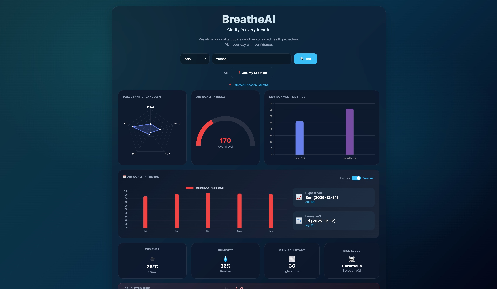
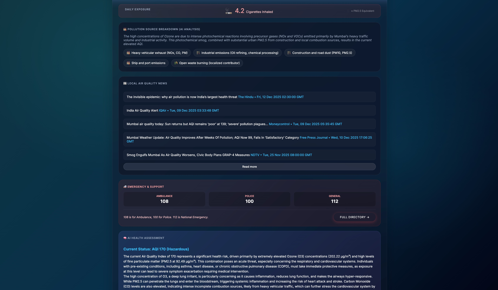
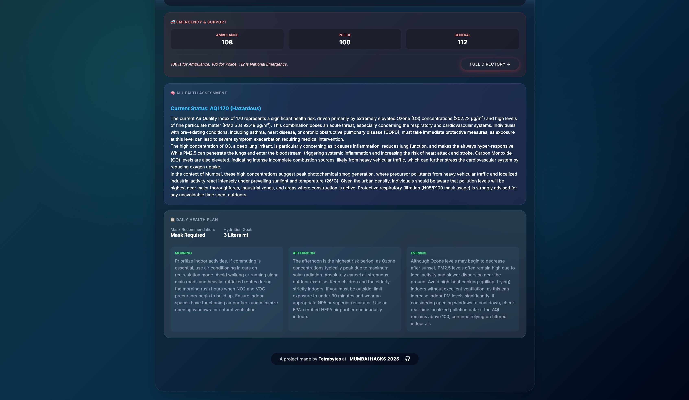
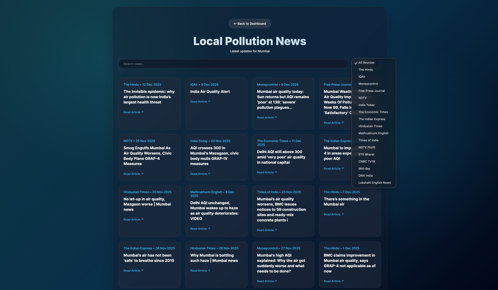
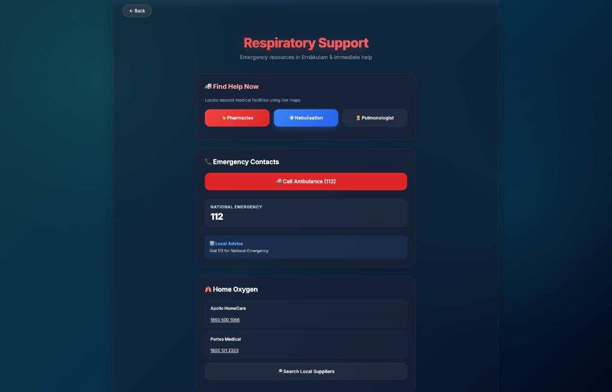

# BreatheAI — Clarity in Every Breath 🌬️

A comprehensive **agentic AI system** designed to help individuals navigate India’s severe air-pollution crisis. BreatheAI uses autonomous agents to collect real-time data, reason about health impacts, and generate personalized action plans.

---

## 📸 Screenshots

| Dashboard & Real-time Metrics |      AI Health Assessment       |
| :---------------------------: | :-----------------------------: |
|  |  |

| Source Analysis & Cigarette Counter |     Local Pollution News      |
| :---------------------------------: | :---------------------------: |
|  |  |

|    Respiratory Support Directory    |
| :---------------------------------: |
|  |

---

# 🌬️ What is BreatheAI?

**BreatheAI** is an intelligent environmental dashboard providing:

- Real-time air quality metrics
- Advanced weather insights
- Personalized health recommendations
- Context-aware daily planning
- Local pollution news
- Emergency support directory

It uses **Google Gemini 1.5 Flash** to generate human-like reasoning, pollution source analysis, and activity plans.

---

## 🚀 Features

- **📡 Real-time Air Quality**  
  PM2.5, PM10, NO₂, SO₂, CO, O₃ — updated live.

- **🚬 Cigarette Equivalent** **(New!)**  
  Instantly converts air pollution into the number of cigarettes inhaled properly displayed in a horizontal bar.

- **🏭 Source Analysis** **(New!)**  
  AI analyzes location context to identify pollution sources (e.g., "Vehicle Emissions", "Stubble Burning").

- **🧠 AI Health Advisory**  
  Personalized recommendations using Google Gemini LLM agents.

- **🗓 Smart Daily Planner**  
  Morning, afternoon, and evening activity guidance.

- **� Pollution Forecasting**  
  5-day AQI trend predictions.

- **🚑 Emergency Support**  
  Location-wise hospitals, ambulances, and helplines.

- **📰 Local News Integration**  
  Pollution-specific news from Google News RSS.

- **📱 Mobile Optimized**  
  Smooth UI with glassmorphism and responsive design.

---

## 📂 Project Structure

```
breatheAI/
├── backend/
│   └── app.py             # Main Flask App
├── ai_models/
│   ├── advisory.py        # Health Reasoning Agent (Gemini)
│   ├── environment.py     # Data Aggregation Service
│   ├── planner.py         # Activity Planner Engine
│   └── news.py            # Google News Scraper
├── frontend/
│   ├── templates/
│   │   ├── index.html     # Dashboard
│   │   ├── news.html      # News Page
│   │   └── support.html   # Support Page
│   └── static/
│       ├── css/           # Glassmorphism Styles
│       └── js/            # Client-side Logic
├── assets/                # Images, Icons
├── .env                   # Environment Variables
├── requirements.txt       # Python Dependencies
└── README.md              # Documentation
```

---

## 🛠️ Setup & Installation

### 1️⃣ Clone the Repository

```bash
git clone https://github.com/Arav-Arun/breatheAI_MumbaiHacks.git
cd breatheAI
```

### 2️⃣ Install Dependencies

```bash
python3 -m venv venv
source venv/bin/activate   # macOS/Linux

pip install -r requirements.txt
```

_(If missing `requirements.txt`, manually install Flask, Requests, python-dotenv, google-generativeai.)_

### 3️⃣ Configure Environment Variables

Create a `.env` file:

```env
OPENWEATHER_API_KEY=your_key_here
AQI_API_KEY=your_key_here
GEMINI_API_KEY=your_gemini_key
```

### 4️⃣ Run the Application

```bash
python3 backend/app.py
```

Visit `http://localhost:5001` in your browser.

---

## � Tech Stack

- **Backend**: Python, Flask
- **AI/LLM**: Google Gemini 1.5 Flash (Agentic Reasoning)
- **Data**: OpenWeatherMap API, WAQI API, Google News RSS
- **Frontend**: HTML, CSS (Glassmorphism), JavaScript
- **Visualization**: Chart.js

---

## 👥 Team Tetrabytes

- Arav Arun
- Harshad Saha
- Asmit Samanta
- Faizaan Farooqui

Built with ❤️ by **Team Tetrabytes** for **Mumbai Hacks 2025**.
